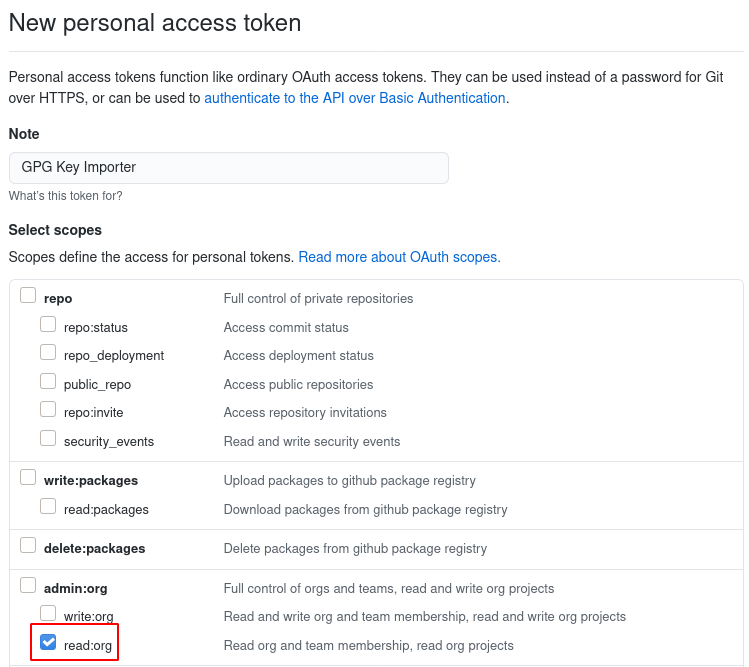

# GitHub Public Key Getter

**Import GPG public keys for all the users in a specified GitHub organisation, and save the keys to files as well**

---

## Requirements

* Bash
* Curl
* Jq
* GPG

You'll also need to generate a GitHub Personal Access Token with the `read:org` scope. PATs can be generated at https://github.com/settings/tokens/new. The below image shows what checkbox you need checked.

## Usage

`./get-gpg-keys.sh` and follow the prompts
